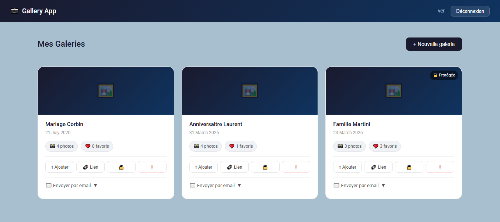
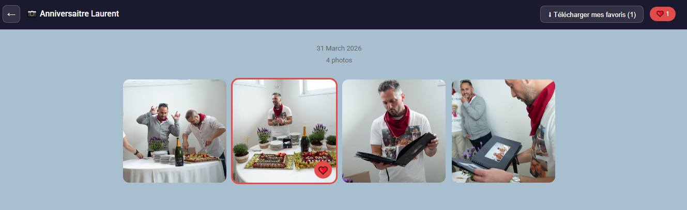

# 📷 Gallery App

Application web de partage de galeries photos entre photographes et clients.



## 🌐 Demo

🔗 **Live** : https://gallery-app-five-iota.vercel.app  
🔗 **Frontend** : https://github.com/PhanDev34000/gallery-app  
🔗 **Backend** : https://github.com/PhanDev34000/gallery-api  

🔐 L'inscription est libre et rapide.

---

## 💡 Contexte

En tant qu'ancien photographe professionnel, j'envoyais 200-300 photos à mes clients via WeTransfer. Ils devaient me renvoyer une liste de numéros de photos à retoucher, c'était fastidieux.

J'ai créé cette application pour digitaliser ce processus : le client reçoit un lien, parcourt les photos et marque ses favoris d'un simple clic.

---

## ✨ Fonctionnalités

### Côté Photographe
- Authentification sécurisée (inscription / connexion)
- Création et gestion de galeries photos
- Upload multiple par drag & drop (jusqu'à 50 photos)
- Envoi du lien par email directement depuis le dashboard
- Protection optionnelle par mot de passe
- Visualisation du nombre de favoris sélectionnés par le client
- Suppression de galeries

### Côté Client
- Accès à la galerie via URL unique sécurisée
- Grille de photos responsive
- Lightbox plein écran avec navigation
- Sélection de photos favorites ❤️
- Téléchargement ZIP des photos favorites

---

## 🏗️ Architecture

### Frontend (Angular 21)
```
gallery-app/
├── components/
│   ├── login/           # Authentification
│   ├── dashboard/       # Gestion des galeries
│   ├── gallery-create/  # Création de galerie
│   ├── gallery-upload/  # Upload de photos
│   └── gallery-view/    # Vue publique client
├── services/
│   ├── auth.ts          # Gestion JWT
│   ├── gallery.ts       # CRUD galeries
│   ├── photo.ts         # Gestion photos
│   └── email.ts         # Envoi emails
└── guards/
    └── auth.guard.ts    # Protection des routes
```

### Backend (Node.js / Express)
```
gallery-api/
├── models/
│   ├── User.js          # Modèle utilisateur
│   ├── Gallery.js       # Modèle galerie
│   └── Photo.js         # Modèle photo
├── routes/
│   ├── auth.js          # Login / Register
│   ├── galleries.js     # CRUD galeries
│   └── photos.js        # Upload, favoris, ZIP
└── middleware/
    ├── auth.js          # Vérification JWT
    └── upload.js        # Configuration Cloudinary
```

---

## 🛠️ Stack Technique

| Catégorie | Technologies |
|-----------|-------------|
| Frontend | Angular 21, TypeScript, Angular Material |
| Backend | Node.js, Express.js |
| Base de données | MongoDB Atlas, Mongoose |
| Stockage photos | Cloudinary |
| Emails | EmailJS |
| Authentification | JWT, Bcrypt |
| Déploiement | Vercel (frontend), Render (backend) |

---

## 🔧 Installation locale

### Prérequis
- Node.js 20+
- Angular CLI
- Compte MongoDB Atlas
- Compte Cloudinary
- Compte EmailJS

### Backend
```bash
git clone https://github.com/PhanDev34000/gallery-api.git
cd gallery-api
npm install
```

Crée un fichier `.env` :
```
PORT=3000
MONGODB_URI=ta_uri_mongodb
JWT_SECRET=ton_secret_jwt
CLOUDINARY_CLOUD_NAME=ton_cloud_name
CLOUDINARY_API_KEY=ta_api_key
CLOUDINARY_API_SECRET=ton_api_secret
```
```bash
npm run dev
```

### Frontend
```bash
git clone https://github.com/PhanDev34000/gallery-app.git
cd gallery-app
npm install
ng serve
```

---

## 🚀 Points techniques remarquables

- **Upload Cloudinary** : Intégration Multer + Cloudinary pour stockage cloud des photos
- **URLs sécurisées** : Génération d'identifiants uniques avec le module `crypto` de Node.js
- **ZIP dynamique** : Téléchargement des favoris en ZIP généré à la volée avec `archiver`
- **EmailJS** : Envoi d'emails depuis le frontend pour éviter les restrictions SMTP
- **Protection par mot de passe** : Hashage bcrypt des mots de passe de galeries
- **ChangeDetectorRef** : Gestion optimisée de la détection de changements Angular

---

## 📸 Screenshots

### Dashboard Photographe


### Vue Publique Client


---

## 👤 Auteur

**Stéphane Vernière**  
🔗 Portfolio : [verniere-dev.fr](https://verniere-dev.fr)  
🔗 GitHub : [@PhanDev34000](https://github.com/PhanDev34000)